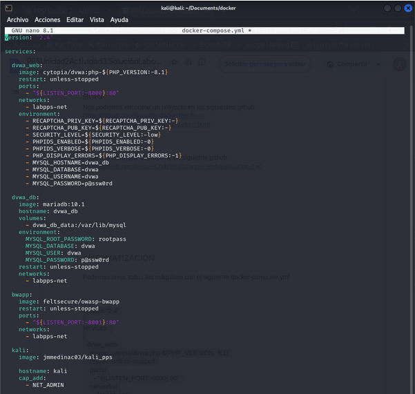
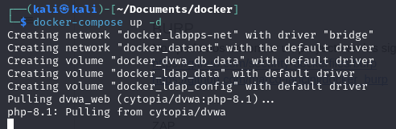
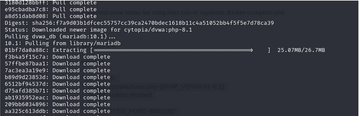
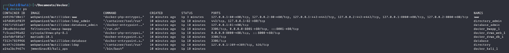
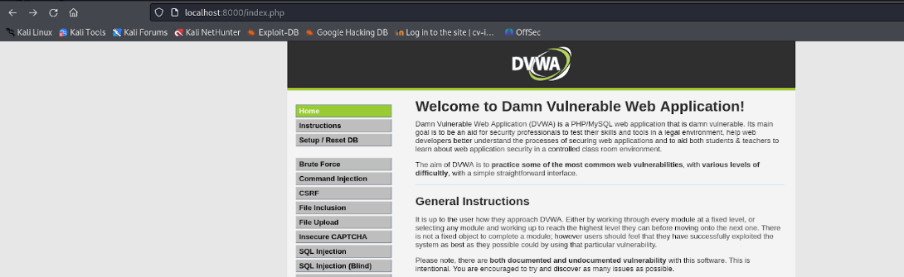
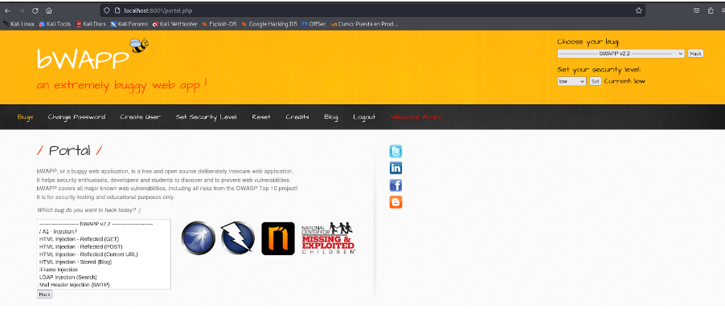
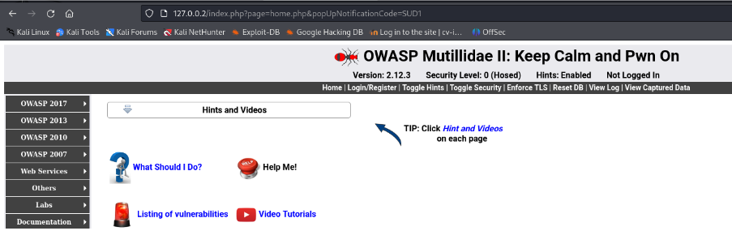
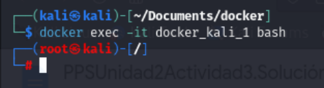

# Creación de entornos de pruebas de vulnerabilidades

Vamos a crear dos escenarios multicontenedor con **Docker** para poner en funcionamiento un laboratorio de máquinas vulnerables y un entorno de pruebas mediante una pila **LAMP**.

## Indice

> [1. Creación de laboratorio de máquinas vulnerables](#creación-de-laboratorio-de-máquinas-vulnerables)

> [2. Creación del entorno de pruebas](#creación-del-entorno-de-pruebas)

## Creación de laboratorio de máquinas vulnerables

Vamos a crear con Docker varios contenedores para las siguientes herramientas de fuentes abiertas:

- **DVWA**
- **bWAPP**
- **Multillidae II**
- **Máquina con Kali Linux**

El método que vamos a utilizar para montar todo lo necesario será mediante un archivo **docker-compose.yml**.

El primer paso es crear el archivo con todo lo necesario:

Una vez creado el archivo, utilizamos **docker-compose up -d** para descargar todas la imágenes y levantar los servicios:

Cuando termine el proceso podemos comprobar que ya se encuentran los servicios:

Contenedor **DVWA**:

Contenedor **bWAPP**:

Contenedor **Mutillidae II**:

Contenedor **Kali**:

------

## Creación del entorno de pruebas

Los servicios que vamos a levantar son lo siguientes:

- Servicio web con ***Apache***
- Servicio de base de datos ***mySQL8***
- Administrador de bases de datos ***PHPMyAdmin***
- Base de datos no SQL: ***Redis***

El primer paso es clonarnos un repositorio de Github que contiene un ***docker-compose.yml*** junto a otros archivos necesario para levantar los servicios:

Una vez clonado, nos movemos a la carpeta del repositorio y copiamos el archivo ***sample.env*** como ***.env***, este archivo va a ser el que contenga las variables de entorno que utiliza el **docker-compose.yml**:

El archivo **.env** tiene el siguiente aspecto:

Una buena práctica de seguridad es cambiar los puertos por defecto que traen los servicios, por esa razón los he modificado.

El siguiente paso es descargar las imágenes y levantar los contenedores, lo podemos hacer con ***docker-compose up -d***:

Al finalizar el proceso ya podemos comprobar que los servicios estén funcionando:

