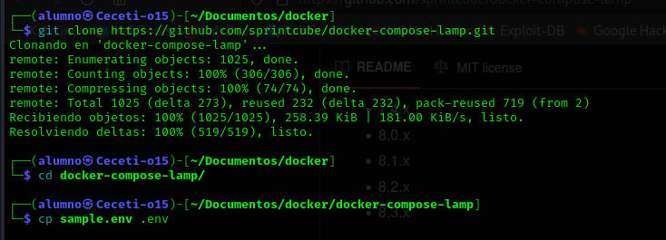
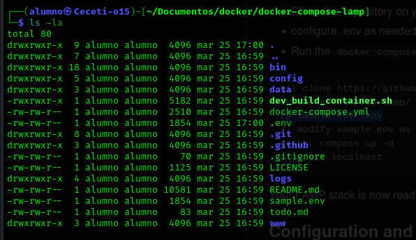
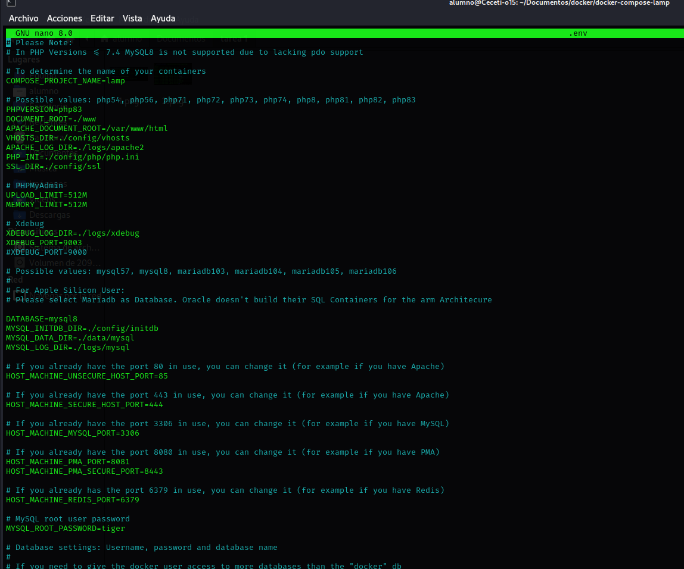
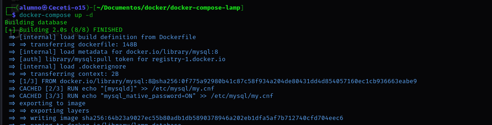
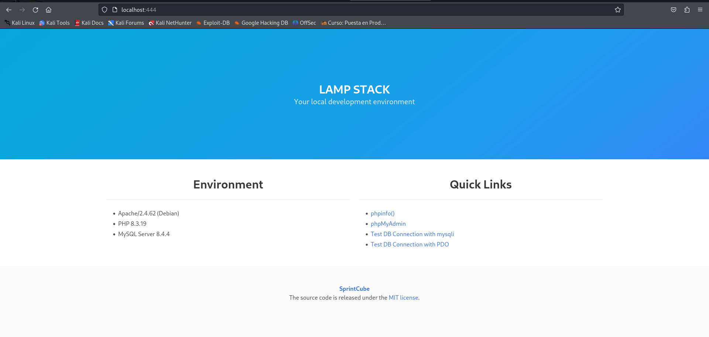
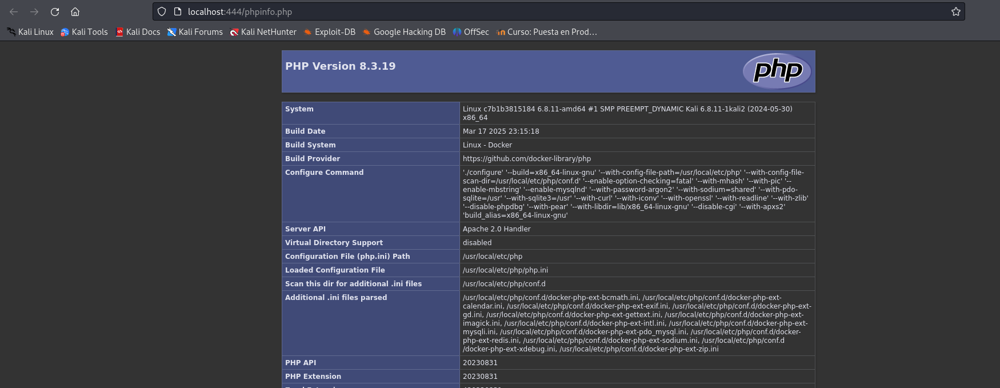
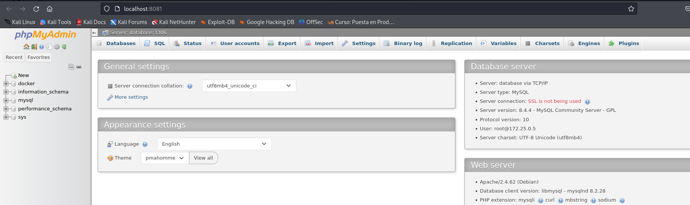

# Creación de entorno de pruebas mediante pila LAMP

Vamos a crear un escenario multicontenedor con **Docker** para poner en funcionamiento una pila **LAMP**.

Los servicios que vamos a levantar son lo siguientes:

- Servicio web con ***Apache***
- Servicio de base de datos ***mySQL8***
- Administrador de bases de datos ***PHPMyAdmin***
- Base de datos no SQL: ***Redis***

El primer paso es clonarnos un repositorio de Github que contiene un ***docker-compose.yml*** junto a otros archivos necesario para levantar los servicios:

Una vez clonado, nos movemos a la carpeta del repositorio y copiamos el archivo ***sample.env*** como ***.env***, este archivo va a ser el que contenga las variables de entorno que utiliza el **docker-compose.yml**:

El archivo **.env** tiene el siguiente aspecto:

Una buena práctica de seguridad es cambiar los puertos por defecto que traen los servicios, por esa razón los he modificado.

El siguiente paso es descargar las imágenes y levantar los contenedores, lo podemos hacer con ***docker-compose up -d***:

Al finalizar el proceso ya podemos comprobar que los servicios estén funcionando:

